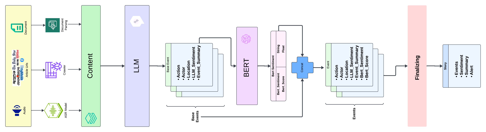
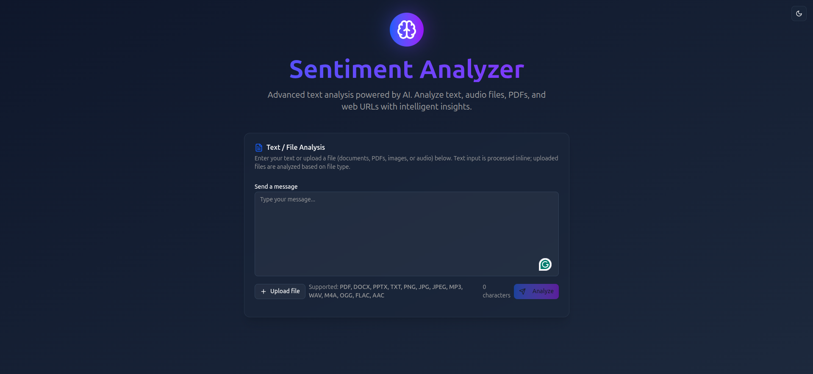

# Sentiment Analyzer : A Redy to Go AI Content Analytical Engine

[](LICENSE)
[](https://www.python.org/)
[](https://fastapi.tiangolo.com/)
[](https://nextjs.org/)
[](https://www.docker.com/)

A comprehensive AI-powered sentiment analysis platform that processes multiple content types including text, audio, documents, and web URLs. Built with modern technologies for scalable, multilingual content analysis.

## 🌟 Features

### 📝 LLM Analysis
- **Text Analysis**: Direct sentiment analysis of text input
- **Audio Analysis**: Speech-to-text transcription with sentiment analysis
- **Document Analysis**: PDF, DOCX, PPTX file processing
- **URL Analysis**: Web content extraction and analysis

### 🤖 AI-Powered Insights
- **LLM Integration**: Support for Ollama, Google Gemini, and OpenAI models
- **Sentiment Classification**: BERT-based Bangla sentiment analysis
- **Feature Extraction**: Structured event and story analysis
- **Multilingual Support**: Optimized for Bangla language processing

### 🏗️ Architecture
- **Microservices**: Modular backend services (BERT, STT, LLM)
- **FastAPI Backend**: High-performance REST API
- **Modern Frontend**: Next.js 15 with responsive UI
- **Docker Support**: Containerized deployment with CPU/CUDA options

### 🎨 User Experience
- **Beautiful UI**: Gradient design with glass morphism
- **Theme Support**: Dark/light mode toggle
- **Responsive Design**: Mobile-first approach
- **Real-time Feedback**: Loading states and progress indicators

## 🏛️ Architecture Overview




## 🚀 Quick Start

### Using Docker (Recommended)

1. **Clone the repository**
   ```bash
   git clone https://github.com/sayedshaun/sentiment-analyzer.git
   cd sentiment-analyzer
   ```

2. **Configure environment**
   ```bash
   touch .env
   # Edit .env with your API keys and settings
   ```

3. **Start services**
   ```bash
   # For CPU-only deployment
   docker-compose -f docker-compose.cpu.yaml up -d

   # For CUDA-enabled deployment (if GPU available)
   docker-compose -f docker-compose.cuda.yaml up -d
   ```

4. **Built in UI to Access the application**
   ```bash
   http://YOUR_HOST:YOUR_PORT
   ```
   


## ⚙️ Configuration

### Environment Variables

Create a `.env` file in the root directory:

```bash
TTS_MODEL=hishab/titu_stt_bn_fastconformer  # User your nemo asr model
OLLAMA_MODEL=gemma4:31b
OLLAMA_URL=https://your-ollama-url/
BERT_MODEL=SayedShaun/bangla-classifier-multiclass # User your model name
UI_PORT=3000
BACKEND_PORT=8000
BACKEND_HOST=localhost
```

### Model Setup

**Ollama Models:**
```bash
ollama pull qwen3:0.6b  # Your Ollama model
```

**Hugging Face Models:**
- BERT Classifier: `SayedShaun/bangla-classifier-multiclass`
- STT Model: `hishab/titu_stt_bn_fastconformer`

## 📖 API Usage

### Text Analysis

```bash
curl -X POST "http://localhost:8012/text/analyze" \
  -H "Content-Type: application/x-www-form-urlencoded" \
  -d "text=Your text here"
```

### Audio Analysis

```bash
curl -X POST "http://localhost:8012/audio/analyze" \
  -F "file=@audio.wav"
```

### Document Analysis

```bash
curl -X POST "http://localhost:8012/document/analyze" \
  -F "file=@document.pdf"
```

### URL Analysis

```bash
curl -X POST "http://localhost:8012/url/analyze" \
  -H "Content-Type: application/x-www-form-urlencoded" \
  -d "url=https://example.com"
```

**Response:**
```json
{
  "story": {
    "events": [
      {
        "summary": "Event description",
        "bert_sentiment": {
          "label": "POSITIVE",
          "score": 0.95
        }
      }
    ],
    "summary": "Overall story summary"
  }
}
```


### Project Structure
```
sentiment-analyzer/
├── docs/                  # Documentation
│
├── src/                   # Backend source code
│   ├── api/               # API routes
│   ├── genai/             # AI/ML components
│   ├── config.py          # Configuration
│   └── logging.py         # Logging setup
│
├── services/              # Microservices
│   ├── bert/              # Sentiment classifier
│   ├── stt/               # Speech-to-text
│   ├── ui/                # Frontend application
│   └── ollama/            # LLM service
│
├── .env
├── docker-compose.cpu.yaml
├── docker-compose.cuda.yaml
├── Dockerfile
├── LICENSE
├── main.py
├── README.md
└── pyproject.toml
```

## 📄 License

This project is licensed under the MIT License - see the [LICENSE](LICENSE) file for details.


## Limitations
While the base LLM is capable of supporting multiple languages, the current Text-to-Speech (TTS) and sentiment analysis models are limited to Bangla. Support for additional languages will be included in future updates.

## Contributing

Contributions are welcome! Please fork the repository and create a pull request.

---

**Made with ❤️ by [Sayed Shaun & GenerativeAI](https://github.com/sayedshaun)**


